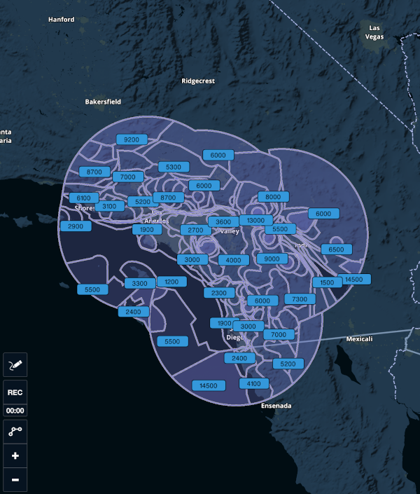
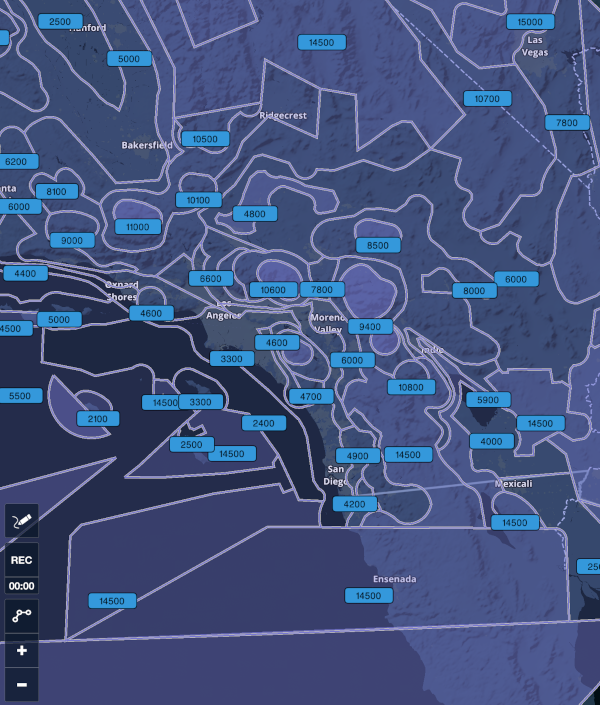

# FAA Minimum Vectoring Altitude (MVA) and Minimum IFR Altitude (MIA) Charts as KML Files

This repository contains a copy of the Minimum Vectoring Altitude
(MVA) and Minimum IFR Altitude (MIA) charts from the Federal Aviation
Administration (FAA).

The originals are provided by the FAA in PDF and XML format, but they
are unsuited for automatic import in EFBs like *ForeFlight*. This
repository includes automatically generated copies in **KML** format
(that can be imported in programs like Google Earth), as well as
**content packs** (that can be imported in ForeFlight).

As an example, this is how the MVAs are drawn over San Diego, CA, once
the Southern California TRACON MVA maps are imported:

  

## Content

* The original XML files from the FAA are in the `mva-faa-xml` and
  `mia-faa-xml` directories respectively, as downloaded from the
  [official
  website](https://www.faa.gov/air_traffic/flight_info/aeronav/digital_products/mva_mia/).

* The converted KML files are in the `mva-kml` and `mia-kml`
  directories; each chart is available independently, and is named
  after the original XML file.

* ForeFlight content packs are in the `contentpack` directory. There
  is a single directory for all maps. Each content pack includes all
  charts from the same ATC TRACON facility of a given type (MVA or
  MIA), and its name includes the map type and the three-characters
  identifier of each facility. You can lookup the TRACON identifiers
  at [this
  link](https://www.faa.gov/about/office_org/headquarters_offices/ato/service_units/air_traffic_services/tracon/).

Each TRACON facility usually publishes two MVA maps, named `FUS3` and
`FUS5`. To the best of my knowledge, they are generated to give 3 and
5 miles, respectively, horizontal clearance from terrain and
obstacles. The `FUS5` maps are usually larger and cover much more
airspace.

You can see how the Los Angeles, CA area (managed by the Southern
California TRACON, or `SCT`) is covered by the current `SCT_MVA_FUS3`
map:

  

As opposed to the current `SCT_MVA_FUS5` map:

  

## Instructions

For instructions on how to download and import the Content Packs into
ForeFlight (**recommended**), please browse the `contentpacks`
directory of this repository and download/share them into the
app. Detailed instructions about how to import Content Packs into
ForeFlight are available at their [support
page](https://www.foreflight.com/support/content-packs/) (search for
"Importing Content Packs").

For instructions on how to download and import KML files into
ForeFlight, please see [this page in the Support
Center](https://support.foreflight.com/hc/en-us/articles/360000219488-User-Content-Creation-and-Importation-Guide). Note:
some users have reported issues with downloading KML files from Github
from their iPads. If you have issues with the download (e.g., the
files are downloaded as plain text), please download them on your
computer and import them with iTunes, or use a Content Pack instead
(recommended).

For instructions on how to download and import KML files into another
program (like Google Earth), please refer to the documentation
provided with that program.

## History

This work was inspired by some episodes of the [Opposing
Bases](https://www.opposingbases.com/) podcast, where the hosts
discussed various uses of the MVA charts by the Air Traffic
Controllers. Specifically, [episode
161](https://opposingbases.libsyn.com/ob161-heading-shmeading/)
included feedback from one of the listeners about how to convert the
XML originals into KML in a semi-automated way. This project was then
featured on [episode
168](https://opposingbases.libsyn.com/ob168-under-there-under-where).

# Legal Disclaimer

All MVA and MIA chart files are property of the FAA. The attached
license notice applies to the conversion scripts only.

All files are provided for educational purposes only. They are not to
be used as a navigation tool. No claim is made regarding the accuracy
of these charts and their contents.

Please direct any comments and discrepancies in the displayed data to
the FAA Air Traffic facility in question.

More information at:
<https://www.faa.gov/air_traffic/flight_info/aeronav/digital_products/mva_mia/>
