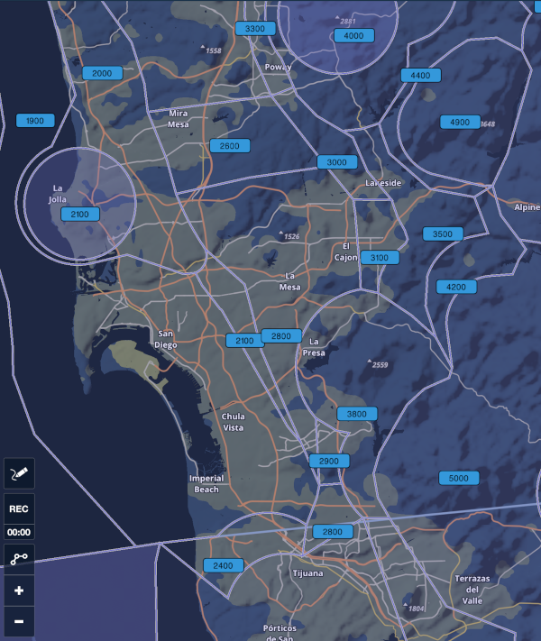

# FAA Minimum Vectoring Altitude (MVA) Charts as KML Files

This repository contains a copy of the Minimum Vectoring Altitude
(MVA) charts from the Federal Aviation Administration (FAA).

The originals are provided by the FAA in PDF and XML format, but they
are unsuited for automatic import in EFBs like *Foreflight*. This
repository includes automatically generated copies in **KML** format,
as well as **content packs** that can be easily imported in
Foreflight.

As an example, this is how the MVAs are drawn over San Diego, CA, once
the Southern California TRACON MVA maps are imported:

  

## Content

* The original XML files from the FAA are in the `faa-xml` directory,
  as downloaded from the [official
  website](https://www.faa.gov/air_traffic/flight_info/aeronav/digital_products/mva_mia/mva/).

* The converted KML files are in the `kml` directory; each chart is
  available independently, and is named after the original XML file.

* Foreflight content packs are in the `contentpack` directory. Each
  content pack includes all charts from the same ATC TRACON facility,
  and its name includes the three-characters identifier of each
  facility. You can lookup the TRACON identifiers at [this
  link](https://www.faa.gov/about/office_org/headquarters_offices/ato/service_units/air_traffic_services/tracon/).

## Instructions

For instructions on how to download and import the Content Packs into
Foreflight (**recommended**), please browse the `contentpacks`
directory of this repository and download/share them into the
app. Detailed instructions about how to import Content Packs into
Foreflight are available at their [support
page](https://www.foreflight.com/support/content-packs/) (search for
"Importing Content Packs").

For instructions on how to download and import KML files into
Foreflight, please see [this page in the Support
Center](https://foreflight.com/support/support-center/category/about-foreflight-mobile/360000219488). Note:
some users have reported issues with downloading KML files from Github
from their iPads. If you have issues with the download (e.g., the
files are downloaded as plain text), please download them on your
computer and import them with iTunes, or use a Content Pack instead
(recommended).

## History

This work was inspired by some episodes of the [Opposing
Bases](https://www.opposingbases.com/) podcast, where the hosts
discussed various uses of the MVA charts by the Air Traffic
Controllers. Specifically, [episode
161](https://www.opposingbases.com/ob161-heading-shmeading/) included
feedback from one of the listeners about how to convert the XML
originals into KML in a semi-automated way.

# Legal Disclaimer

All MVA chart files are property of the FAA. The attached license
notice applies to the conversion scripts only.

All files are provided for educational purposes only. They are not to
be used as a navigation tool. No claim is made regarding the accuracy
of these charts and their contents.

Please direct any comments and discrepancies in the displayed data to
the FAA Air Traffic facility in question.

More information at:
<https://www.faa.gov/air_traffic/flight_info/aeronav/digital_products/mva_mia/mva/>
